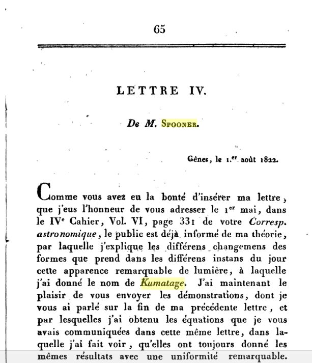
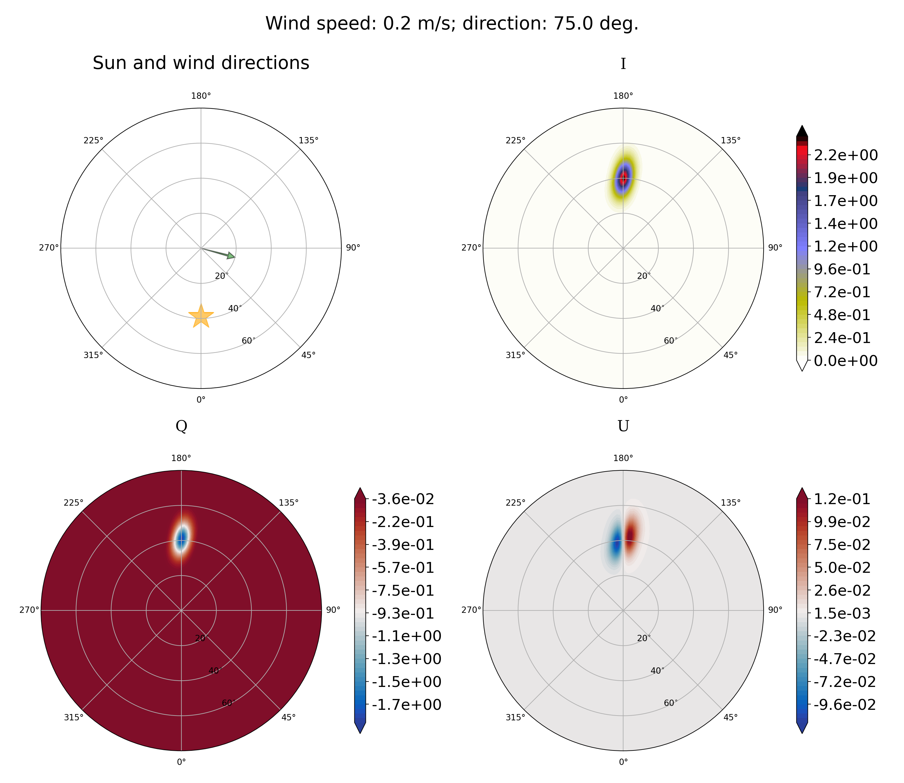
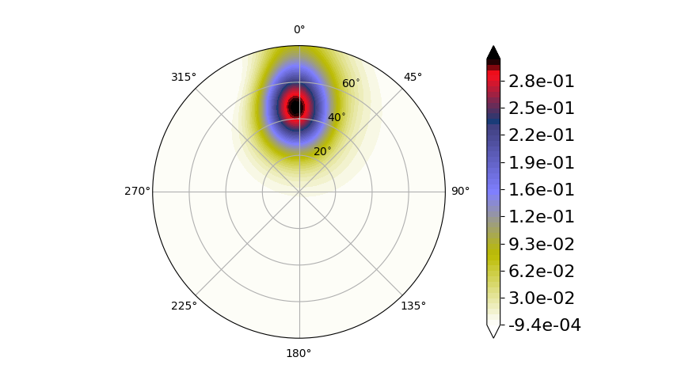
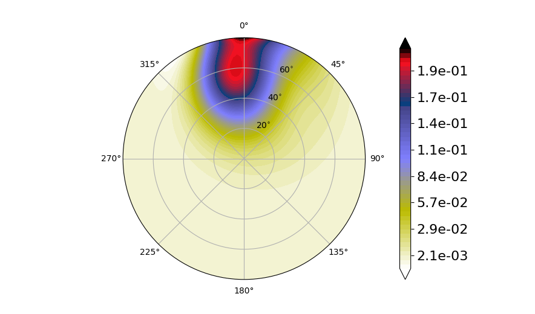
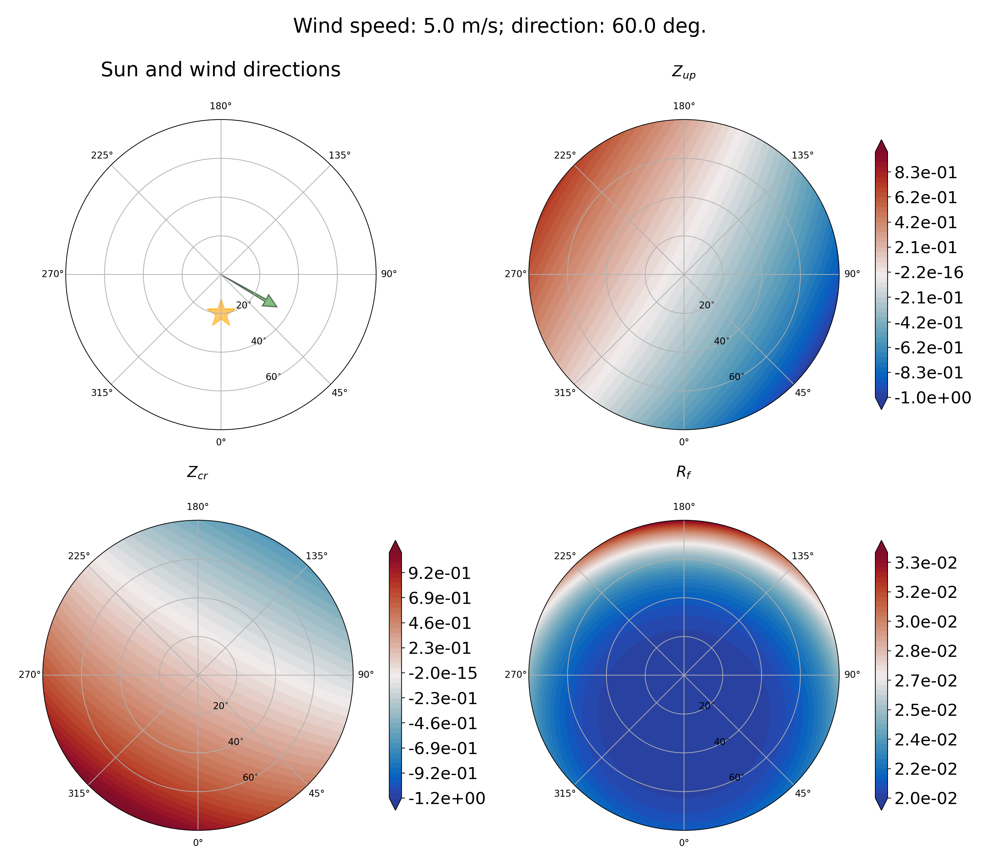

# coxmunk

Simple sunglint computation based on [Cox & Munk](https://www.osapublishing.org/josa/abstract.cfm?uri=josa-44-11-838) model.
For more details on the statistics of the wave slopes (i.e., *Probability Distribution Function*), please refer to [Munk 2009](https://www.annualreviews.org/doi/abs/10.1146/annurev.marine.010908.163940).


## Getting Started

These instructions will get you a copy of the project up and running on your local machine for development and testing purposes.

### Prerequisites

Python >= 3.8 and a recent `pip`:

```
python3 -m pip install --upgrade pip
```

### Installing

First, clone [the repository](https://github.com/Tristanovsk/coxmunk#) and execute the following command in the
local copy:

```
python3 -m pip install .
```

For development (editable install, code changes are picked up without reinstalling):

```
python3 -m pip install -e .
```

If you do not have administrator rights, add `--user` (or, preferably, use a virtual environment):

```
python3 -m pip install --user .
```

This installation is supposed to download
all the associated packages as well as prepare the executables `coxmunk`.

If the installation is successful, you should have:
```
$ coxmunk
Usage:
  coxmunk <sza> <wind_speed> [--stats <stats>] [--wind_azi <wind_azi>] [--shadow] [--slope] [--figname <figname>]
  coxmunk -h | --help
  coxmunk -v | --version
```

The model can also be used from Python:

```python
from coxmunk import sunglint

# geometry in degrees: solar zenith, viewing zenith, relative azimuth (180° = Sun and sensor in opposition)
I, Q, U, V = sunglint(sza=30, vza=30, azi=180).sunglint(ws=5, wazi=0, stats='bh2006', shadow=True)
```

The full documentation, with the API reference and tutorials, is on
[Read the Docs](https://coxmunk.readthedocs.io).

## Model description

The sea surface is described as a collection of plane facets whose slopes follow the
statistics of Cox & Munk (1954). The glint observed in a given direction comes from the
facets tilted so that the Sun is specularly reflected toward the sensor.

### Reflecting facet

With the solar and viewing zenith angles $\theta_s$, $\theta_v$ ($\mu = \cos\theta$) and the
relative azimuth $\phi$ (180° when Sun and sensor are in opposition), the scattering angle
$\Theta$, the angle of incidence on the facet $\omega$ and the facet tilt $\theta_n$ are

```math
\cos\Theta = -\mu_s\mu_v - \sin\theta_s\sin\theta_v\cos\phi, \qquad
\omega = \frac{\pi - \Theta}{2}, \qquad
\cos\theta_n = \frac{\mu_s + \mu_v}{2\cos\omega}
```

The facet slopes are computed in the Sun frame and rotated into the wind frame, with
$\phi_w$ the downwind direction counted counterclockwise from the Sun:

```math
z_x = -\frac{\sin\theta_v \cos\phi + \sin\theta_s}{\mu_s + \mu_v}, \quad
z_y = -\frac{\sin\theta_v \sin\phi}{\mu_s + \mu_v}, \quad
z_{up} = \cos\phi_w \, z_x + \sin\phi_w \, z_y, \quad
z_{cr} = -\sin\phi_w \, z_x + \cos\phi_w \, z_y
```

### Wave slope statistics

For the isotropic statistics (`cm_iso`), with the wind speed $U$ in m/s:

```math
\sigma^2 = 0.003 + 5.12\times10^{-3}\,U, \qquad
P = \frac{1}{\pi\sigma^2} \exp\left(-\frac{\tan^2\theta_n}{\sigma^2}\right)
```

For the anisotropic statistics (`cm_dir`, `bh2006`), the Gram-Charlier expansion is written
with the convention of Munk (2009), with $\xi = z_{up}/\sigma_{up}$ and $\eta = z_{cr}/\sigma_{cr}$:

```math
P(\xi, \eta) = \frac{e^{-(\xi^2 + \eta^2)/2}}{2\pi\,\sigma_{up}\,\sigma_{cr}}
\Big[ 1
+ \tfrac{c_{12}}{2}\,\xi\,(1 - \eta^2)
- \tfrac{c_{30}}{6}\,\xi\,(3 - \xi^2)
+ \tfrac{c_{40}}{24}\,(3 - 6\xi^2 + \xi^4)
+ \tfrac{c_{22}}{4}\,(1 - \xi^2)(1 - \eta^2)
+ \tfrac{c_{04}}{24}\,(3 - 6\eta^2 + \eta^4)
\Big]
```

where $c_{12} = -c_{21}$ and $c_{30} = -c_{03}$, with the coefficients:

| Parameter | `cm_dir` (Cox & Munk, 1954) | `bh2006` (Bréon & Henriot, 2006) |
|---|---|---|
| $\sigma_{cr}^2$ | $0.003 + 1.92\times10^{-3}\,U$ | $0.003 + 1.85\times10^{-3}\,U$ |
| $\sigma_{up}^2$ | $3.16\times10^{-3}\,U$ | $0.001 + 3.16\times10^{-3}\,U$ |
| $c_{21}$ | $0.01 - 8.6\times10^{-3}\,U$ | $-9\times10^{-4}\,U^2$ |
| $c_{03}$ | $0.04 - 0.033\,U$ | $-0.45 / (1 + e^{7 - U})$ |
| $c_{40}$ | 0.40 | 0.30 |
| $c_{22}$ | 0.12 | 0.12 |
| $c_{04}$ | 0.23 | 0.40 |

### Fresnel reflection

With the refractive index of water $m$ (default 1.334), the reflection coefficients
parallel and perpendicular to the plane of incidence are

```math
r_l = \frac{\sqrt{m^2 - \sin^2\omega} - m^2\cos\omega}{\sqrt{m^2 - \sin^2\omega} + m^2\cos\omega},
\qquad
r_r = \frac{\cos\omega - \sqrt{m^2 - \sin^2\omega}}{\cos\omega + \sqrt{m^2 - \sin^2\omega}}
```

giving the Mueller reflection matrix

```math
\mathbf{R}_F(\omega) = \frac{1}{2}
\begin{pmatrix}
r_l^2 + r_r^2 & r_l^2 - r_r^2 & 0 & 0 \\
r_l^2 - r_r^2 & r_l^2 + r_r^2 & 0 & 0 \\
0 & 0 & 2 r_l r_r & 0 \\
0 & 0 & 0 & 2 r_l r_r
\end{pmatrix}
```

which is rotated from the meridian planes into the scattering plane,
$\mathbf{R} = \mathbf{L}(\pi - \sigma_2)\,\mathbf{R}_F\,\mathbf{L}(-\sigma_1)$.

### Shadowing and hiding

With `--shadow` (`shadow=True` in Python), the facets hidden by the waves are removed
with the Smith function (Ross & Dion, 2005, 2007):

```math
\Lambda(\theta, \varphi) = \frac{e^{-\nu^2} - \nu\sqrt{\pi}\,\mathrm{erfc}(\nu)}{2\,\nu\sqrt{\pi}},
\qquad
\nu = \frac{1}{\sqrt{2}\,\sigma(\varphi)\tan\theta},
\qquad
\sigma^2(\varphi) = \sigma_{up}^2\cos^2\varphi + \sigma_{cr}^2\sin^2\varphi
```

```math
SH = \frac{1}{1 + \Lambda(\theta_s, -\phi_w) + \Lambda(\theta_v, \phi - \phi_w)}
```

where $\varphi$ is the azimuth of the direction relative to the upwind axis.

### Sunglint Stokes vector

The sunglint, in reflectance units, is finally

```math
\begin{pmatrix} I \\ Q \\ U \\ V \end{pmatrix}
= \frac{\pi \, P \, SH}{4 \, \mu_s \, \mu_v \cos^4\theta_n}
\begin{pmatrix} R_{11} \\ R_{21} \\ R_{31} \\ R_{41} \end{pmatrix}
```

### References

- Cox, C. and Munk, W. (1954). Measurement of the roughness of the sea surface from photographs of the Sun's glitter. *J. Opt. Soc. Am.*, 44(11), 838-850.
- Bréon, F.-M. and Henriot, N. (2006). Spaceborne observations of ocean glint reflectance and modeling of wave slope distributions. *J. Geophys. Res.*, 111, C06005.
- Munk, W. (2009). An inconvenient sea truth: spread, steepness, and skewness of surface slopes. *Annu. Rev. Mar. Sci.*, 1, 377-415.
- Ross, V., Dion, D. and Potvin, G. (2005). Detailed analytical approach to the Gaussian surface bidirectional reflectance distribution function specular component applied to the sea surface. *J. Opt. Soc. Am. A*, 22(11), 2442-2453.
- Harmel, T. and Chami, M. (2012). Determination of sea surface wind speed using the polarimetric and multidirectional properties of satellite measurements in visible bands. *Geophys. Res. Lett.*, 39, L19611, doi:10.1029/2012GL053508.
- Harmel, T. and Chami, M. (2013). Estimation of the sunglint radiance field from optical satellite imagery over open ocean: multidirectional approach and polarization aspects. *J. Geophys. Res. Oceans*, 118, doi:10.1029/2012JC008221.
- Ross, V. and Dion, D. (2007). Sea surface slope statistics derived from Sun glint radiance measurements and their apparent dependence on sensor elevation. *J. Geophys. Res.*, 112, C09015.

## Polarization and wind speed retrieval

Since the polarization of the glint only depends on the geometry while its amount depends on the
sea state, multidirectional and polarized measurements (e.g., POLDER/PARASOL) can be used to
retrieve the sunglint Stokes vector (Harmel & Chami, 2013) and the sea surface wind speed
(Harmel & Chami, 2012). The `coxmunk.wind` module implements the forward model (sunglint plus
whitecaps) and the Levenberg-Marquardt inversion of Harmel & Chami (2012):

```python
import numpy as np
from coxmunk.wind import glint_whitecap, retrieve_wind_speed

# 14 viewing directions along a satellite track: (sza, vza, azi) in degrees
geometries = np.array([(30, abs(v), 150 if v >= 0 else 330) for v in np.linspace(-55, 55, 14)])
observed = glint_whitecap(geometries, ws=8)          # synthetic I, Q, U measurements
res = retrieve_wind_speed(observed, geometries)       # -> res.ws, res.sigma, res.flag
```

See the [polarization](https://coxmunk.readthedocs.io/en/latest/polarization.html) and
[wind speed](https://coxmunk.readthedocs.io/en/latest/wind_speed.html) chapters of the documentation.

## Kumatage: from noise to signal



In 1822, Spooner named *Kumatage* (from the Greek κυμάτων, *of the waves*, and αὐγή, *splendour*)
"this remarkable appearance of light" of the Sun reflected by the waves, and established its first
equations. Navigators filtered it out as a glare, painters made it a subject, Cox & Munk turned it
into a measurement of the sea surface slopes, ocean color remote sensing removed it as a noise, and
it is now exploited as a signal on winds, waves, currents and slicks. The
[Kumatage chapter](https://coxmunk.readthedocs.io/en/latest/kumatage.html) of the documentation
retraces this history (adapted from Harmel, Bary, Gernez & Morin, OCEANEXT 2019), with paintings
and Sentinel-2 images.

## Examples

Examples for [Cox & Munk](https://www.osapublishing.org/josa/abstract.cfm?uri=josa-44-11-838) model with [Bréon & Henriot](https://agupubs.onlinelibrary.wiley.com/doi/full/10.1029/2005JC003343) statistics for:
- solar zenith angle = 39°
- wind azimuth from Sun = 75°
- wind speed = 0.2, 7.2, 14.2 m.s<sup>-1</sup>

```
$ coxmunk 39 0.2 --stats bh2006 --wind_azi 75 --figname illustration/coxmunk_fig_39_0.2_bh2006_75.png
```




```
$ coxmunk 39 7.2 --stats bh2006 --wind_azi 75
```




```
$ coxmunk 39 14.2 --stats bh2006 --wind_azi 75
```



With the option `--slope` you can also check
 the values of wave slopes upwind and crosswind,
 the first term of the Fresnel matrix and the probability distribution function:

```
$ coxmunk 20 5 --stats bh2006 --wind_azi 60 --slope
```


