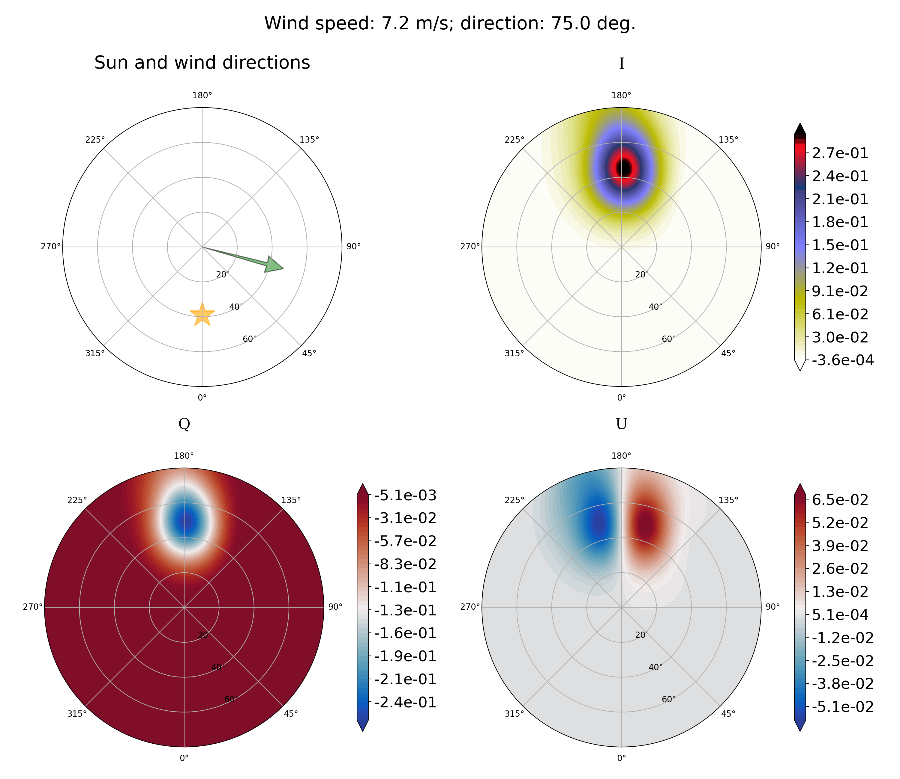

# coxmunk

Simple sunglint computation based on [Cox & Munk](https://www.osapublishing.org/josa/abstract.cfm?uri=josa-44-11-838) model.
For more details on the statistics of the wave slopes (i.e., *Probability Distribution Function*), please refer to [Munk 2009](https://www.annualreviews.org/doi/abs/10.1146/annurev.marine.010908.163940).


## Getting Started

These instructions will get you a copy of the project up and running on your local machine for development and testing purposes.

### Prerequisites

What things you need to install the software and how to install them

```
python3 -m pip install --user --upgrade setuptools
```

### Installing

First, clone [the repository](https://github.com/Tristanovsk/coxmunk#) and execute the following command in the
local copy:

```
python3 setup.py install 
```

This will install the package into the system's Python path.
If you have not the administrator rights, you can install the package as follows:

```
python3 setup.py install --user
```

If another destination directory is preferred, it can be set by

```
python3 setup.py install --prefix=<where-to-install>
```

This installation is supposed to download
and compile all the associated packages as well as prepare the executables `coxmunk`.

If the installation is successful, you should have:
```
$ coxmunk
Usage:
  coxmunk <sza> <wind_speed> [--stats <stats>] [--wind_azi <wind_azi>]
  coxmunk -h | --help
  coxmunk -v | --version
```

## Running the tests

Examples for [Cox & Munk](https://www.osapublishing.org/josa/abstract.cfm?uri=josa-44-11-838) model with [Bréon & Henriot](https://agupubs.onlinelibrary.wiley.com/doi/full/10.1029/2005JC003343) statitics for:
- solar vieving angle = 39°
- wind azimuth from Sun = 75°
- wind speed = 0.2, 7.2, 14.2 m.s<sup>-1</sup>

```
$ coxmunk 39 0.2 --stats bh2006 --wind_azi 75 --figname illustration/coxmunk_fig_39_0.2_bh2006_75.png
```


```
$ coxmunk 39 7.2 --stats bh2006 --wind_azi 75
```




```
$ coxmunk 39 14.2 --stats bh2006 --wind_azi 75
```


