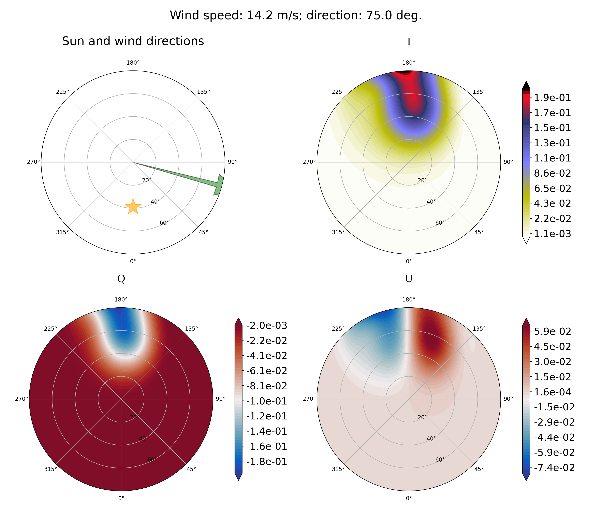

# coxmunk

Simple sunglint computation based on Cox and Munk model


## Getting Started

These instructions will get you a copy of the project up and running on your local machine for development and testing purposes.

### Prerequisites

What things you need to install the software and how to install them

```
python3 -m pip install --user --upgrade setuptools
```

### Installing

First, clone [the repository](https://github.com/Tristanovsk/coxmunk#) and execute the following command in the
local copy:

```
python3 setup.py install 
```

This will install the package into the system's Python path.
If you have not the administrator rights, you can install the package as follows:

```
python3 setup.py install --user
```

If another destination directory is preferred, it can be set by

```
python3 setup.py install --prefix=<where-to-install>
```

This installation is supposed to download
and compile all the associated packages as well as prepare the executables `coxmunk`.

If the installation is successful, you should have:
```
$ coxmunk
Usage:
  coxmunk <sza> <wind_speed> [--stats <stats>] [--wind_azi <wind_azi>]
  coxmunk -h | --help
  coxmunk -v | --version
```

## Running the tests

```
$ coxmunk 39 0.2 --stats bh2006 --wind_azi 75
```


```
$ coxmunk 39 7.2 --stats bh2006 --wind_azi 75
```


```
$ coxmunk 39 14.2 --stats bh2006 --wind_azi 75
```


