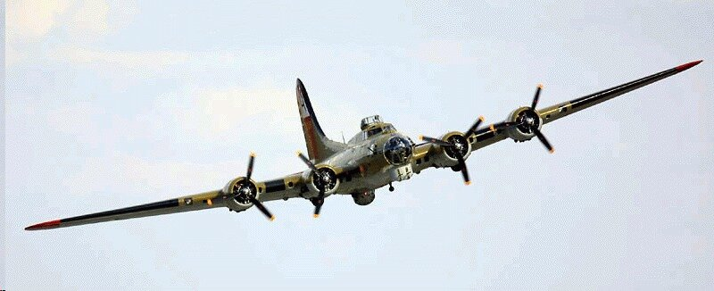

Cox & Munk: the glitter as a measurement
========================================

A century after Spooner, the splendour of the waves became a **measurement**.
Charles S. Cox and Walter H. Munk, of the Scripps Institution of Oceanography,
turned the photographs of the Sun glitter into the first statistics of the sea
surface slopes [CoxMunk1954]_. Their model is the basis of the ``coxmunk``
package.

The authors
-----------

.. list-table::
   :widths: 35 65

   * - .. figure:: ../../../illustration/history/walter_munk_2010_crafoord_prize.jpg
          :width: 100%
          :alt: Walter Munk in 2010

          Walter Munk at the Crafoord Prize press conference, Stockholm, 2010.
          Photo: Holger Motzkau, `Wikimedia Commons
          <https://commons.wikimedia.org/wiki/File:Crafoordprize_2010-11_(cropped).jpg>`_,
          CC BY-SA 3.0.
     - **Walter H. Munk** (1917-2019) spent his career at Scripps, where he
       worked on wind waves and swell, ocean currents, tides and ocean
       acoustics. He received the Crafoord Prize in geosciences in 2010.

       **Charles S. "Chip" Cox** (died 2015) obtained his PhD in oceanography
       at Scripps in 1954 with this work on the sun glitter, and later became
       a professor at Scripps, known for his studies of electromagnetic
       phenomena in the ocean and of sea-floor pressure.

       More than half a century later, Munk revisited the slope statistics of
       the 1950s in the light of new observations [Munk2009]_.

The 1951 campaign off Hawaii
----------------------------

In 1951, Cox and Munk mounted cameras in the bomb bay of a surplus World War II
B-17G aircraft and photographed the Sun glitter on the Pacific Ocean near the
Hawaiian Islands, while the wind was measured from a vessel, the *Reverie*,
below. The brightness at each point of the glitter photographs gives the
probability that a facet of the sea surface has the slope needed to reflect the
Sun toward the camera.

   A B-17G Flying Fortress, the type of aircraft used by Cox and Munk in 1951
   (here the Collings Foundation "Nine O Nine"). Photo: US Federal Government,
   public domain, `Wikimedia Commons
   <https://commons.wikimedia.org/wiki/File:Collings_Foundation_B-17G_Flying_Fortress_%22Nine_O_Nine%22_in_Flight.jpg>`_.

From glitter to slope statistics
--------------------------------

The brightness of the glitter at a given point of the image is proportional to
the number of facets oriented to reflect the Sun toward the camera, i.e., to the
slope probability density :math:`P` (:doc:`../algorithms`):

.. math::

   I_{glint} = \frac{\pi \, R_F(\omega) \, P(z_{up}, z_{cr})}{4 \, \mu_s \, \mu_v \cos^4\theta_n},
   \qquad
   P(z_{up}, z_{cr}) = f(\text{wind speed}, \text{wind direction})

From the photographs, Cox and Munk derived:

* the mean square slopes in the upwind and crosswind directions, increasing
  linearly with the wind speed;
* the departure of the slope distribution from a Gaussian, described by a
  Gram-Charlier expansion with skewness and peakedness coefficients
  (:eq:`pdf_gc`);
* the effect of slicks, which damp the small waves and reduce the slopes.

The glitter pattern is therefore a picture of the wind at the sea surface. Their
papers [CoxMunk1954]_ (*J. Opt. Soc. Am.*, and *Statistics of the sea surface
derived from sun glitter*, *J. Mar. Res.*, 13, 198-227, 1954) and the
detailed report *Slopes of the sea surface deduced from photographs of sun
glitter* (Scripps Institution of Oceanography, 1956) had been cited more than
2400 times by 2019. The ``cm_iso`` and ``cm_dir`` statistics of ``coxmunk``
are those of Cox and Munk; ``bh2006`` is their reassessment from satellite data
[BreonHenriot2006]_.

The :doc:`../tutorials/kumatage` tutorial uses the model to simulate the
kumatage seen from the deck of a ship. The next step of this history is
:doc:`the satellite era <satellite_era>`.
