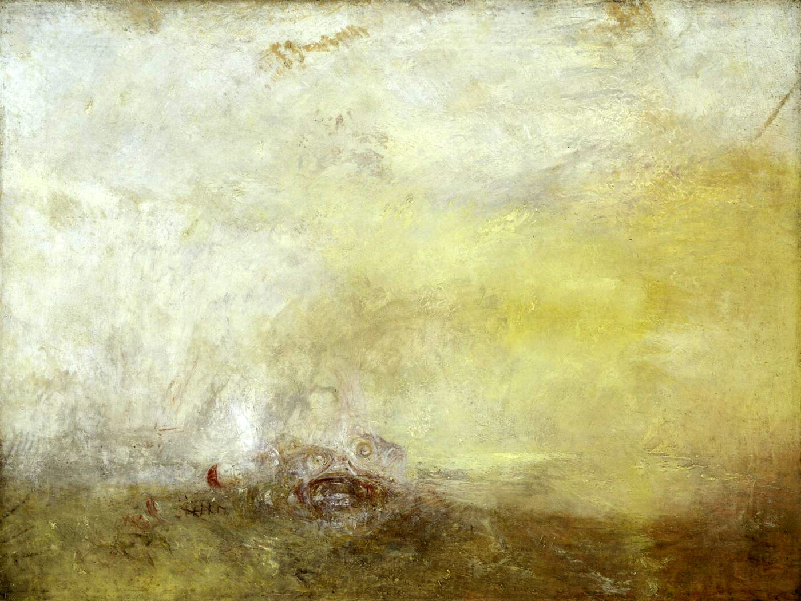
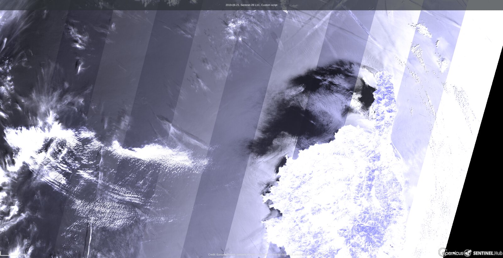
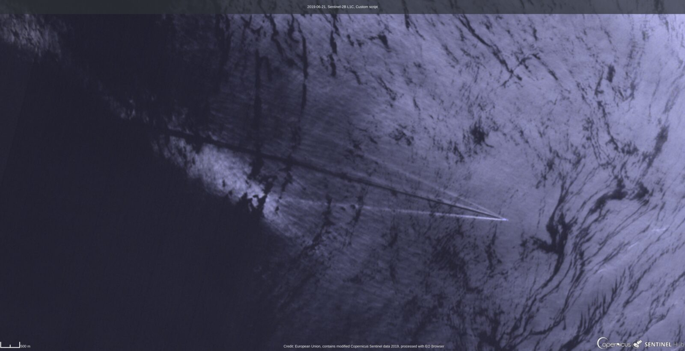
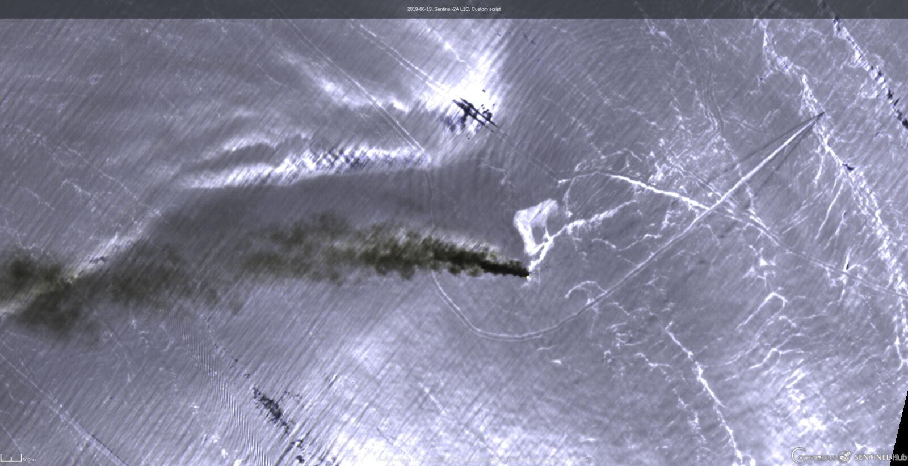

Kumatage: from noise to signal
==============================

.. epigraph::

   *Je grimpai en tête de mât pour faire un tour d'horizon. J'étais aveuglé par
   le soleil levant à l'est. [...] Les vagues pailletées d'or, encombrées de
   petite écume blanche [...]. Nous pouvions serrer le vent et mettre le cap sur
   la pointe de Porto Rico.*

   -- J.-M. Quéméner, *La république des pirates*, Plon, 2019

The reflection of the Sun on the sea surface has been, in turn, a hazard for
navigators, a subject for painters, a measurement tool for oceanographers, a
noise to be removed from satellite images and finally a signal on the state of
the ocean surface. This chapter retraces this history and connects it with the
model implemented in ``coxmunk``. It is adapted from the talk *Scientific
representation of the Sun reflection on the sea surface: how an unwanted noise
becomes signal* (T. Harmel, S. Bary, P. Gernez and G. Morin, OCEANEXT 2019
interdisciplinary conference, Nantes, July 2019,
`doi:10.13140/RG.2.2.25132.41602 <https://doi.org/10.13140/RG.2.2.25132.41602>`_).

   *Sunrise with Sea Monsters*, J. M. W. Turner, c. 1845 (Tate, London).

The word: Kumatage
------------------

In 1822, a correspondent named Spooner wrote from Genoa to the *Correspondance
astronomique, géographique, hydrographique et statistique* edited by Baron
Franz Xaver von Zach. In a first letter (1 May 1822, vol. VI, p. 331), he
explained the changes of shape taken over the day by "this remarkable
appearance of light", to which he gave the name of **Kumatage**. In a second
letter (*Lettre IV*, 1 August 1822, p. 65), he sent the demonstrations of the
equations announced in the first one, which, he wrote, "always gave the same
results with a remarkable uniformity".

.. list-table::
   :widths: 50 50

   * - .. figure:: ../../illustration/kumatage/zach_1822_correspondance_astronomique.jpg
          :width: 100%

          *Correspondance astronomique* of Baron de Zach (1822).
     - .. figure:: ../../illustration/kumatage/spooner_1822_lettre_IV.jpg
          :width: 100%

          Spooner, *Lettre IV*, Genoa, 1 August 1822: "[...] cette apparence
          remarquable de lumière, à laquelle j'ai donné le nom de *Kumatage*."

The word is built from the Greek κυμάτων (*of the waves*, Latin *undarum*) and
αὐγή (*splendour*): the **splendour of the waves**.

The term found its way into navigation manuals. The *New American Practical
Navigator* of N. Bowditch (12th edition, 1841) explains, in the chapter
*Description and use of a sextant of reflection*, that

   [...] The paler glass is sometimes used in observing altitudes at sea, to
   take off the strong glare of the horizon below the sun, arising from the
   sun's light, reflected irregularly from the small rippling waves—an
   appearance which has lately been called kumatage.

and its dictionary of sea terms defines

   **Kumatage**: a bright appearance in the horizon, under the sun or moon,
   arising from the reflected light of those bodies from the small rippling
   waves on the surface of the water.

.. list-table::
   :widths: 40 60

   * - .. figure:: ../../illustration/kumatage/bowditch_1841_practical_navigator.jpg
          :width: 100%

          *The New American Practical Navigator*, N. Bowditch, 1841.
     - .. figure:: ../../illustration/kumatage/aivazovsky_1852_fishermen_on_the_seashore.jpg
          :width: 100%

          *Fishermen on the Seashore*, I. Aivazovsky, 1852.

For the navigator, the kumatage was a **noise**: a glare to be filtered out with
a tinted glass to measure the altitude of the Sun above the horizon.

Light, photography and painting
-------------------------------

Spooner's kumatage belongs to a century that changed the representation of
light. The wave theory of light grew from Fresnel's manuscript *Rêveries* (1815)
to Maxwell's equations; Niépce obtained the first photographic images (1816);
and painters abandoned classicism to depict light in its changing qualities, a
movement named after Monet's *Impression, soleil levant* (1872), in which the
reflection of the Sun on the water is the subject itself.

.. list-table::
   :widths: 60 40

   * - .. figure:: ../../illustration/kumatage/monet_1872_impression_soleil_levant.jpg
          :width: 100%

          *Impression, soleil levant*, C. Monet, 1872 (Musée Marmottan Monet, Paris).
     - .. figure:: ../../illustration/kumatage/kulbin_1916_seascape.jpg
          :width: 100%

          *Seascape*, N. Kulbin, 1916.

The word kumatage, however, fell into disuse: without a scientific application,
the phenomenon kept fascinating painters but lost its name.

The Cox & Munk revolution
-------------------------

A century later, the splendour of the waves became a **measurement**. From
aerial photographs of the Sun glitter taken off Hawaii in 1951, Cox and Munk
derived the statistics of the sea surface slopes and their dependence on wind
speed and direction [CoxMunk1954]_. The brightness of the glitter at a given
point of the image is proportional to the number of facets oriented to reflect
the Sun toward the camera, i.e., to the slope probability density :math:`P`
(:doc:`algorithms`):

.. math::

   I_{glint} = \frac{\pi \, R_F(\omega) \, P(z_{up}, z_{cr})}{4 \, \mu_s \, \mu_v \cos^4\theta_n},
   \qquad
   P(z_{up}, z_{cr}) = f(\text{wind speed}, \text{wind direction})

The glitter pattern is therefore a picture of the wind at the sea surface. This
work, cited more than 2400 times by 2019, is the basis of the ``coxmunk``
package. The :doc:`tutorials/kumatage` tutorial uses it to simulate the
kumatage seen from the deck of a ship.

From ship deck to satellite sensors
-----------------------------------

Seen from a satellite, the kumatage becomes the **sunglint**. For ocean color
remote sensing, which monitors phytoplankton, suspended and dissolved matter
from the light leaving the water, it is again a noise: the glint is often one
order of magnitude brighter than the water signal and blinds a large part of
the swath of sensors such as MERIS or Sentinel-3/OLCI. Dedicated algorithms were
developed to remove it, e.g., from the shortwave-infrared bands of
Sentinel-2/MSI [Harmel2018]_.

The same glint is also a **signal**. The multidirectional and polarized
measurements of the POLDER and PARASOL satellite sensors confirmed the Cox and
Munk statistics at the global scale [BreonHenriot2006]_ [Munk2009]_, and were
used to retrieve the sunglint Stokes vector (:doc:`polarization`) and the sea
surface wind speed (:doc:`wind_speed`) at a resolution of a few kilometres.

At the 10 to 20 m resolution of Sentinel-2, the glint reveals the fine
structure of the sea surface roughness. In the images below (shortwave-infrared
bands), the whiter the sea, the more sunglint.

   Sunglint around Cape Corsica (Sentinel-2B, 21 June 2019). The dark area in the
   lee of the island is sheltered from the wind: the calm water reflects the Sun
   only near the specular direction, outside of the field of view. The stripes
   are the boundaries of the detectors of the instrument, which observe the
   surface under slightly different viewing angles.

   Zoom on the same image: wakes of ships and slicks modify the roughness and
   the glint.

.. list-table::
   :widths: 50 50

   * - .. figure:: ../../illustration/kumatage/s2_2018-10-04_ligurian_sea_sunglint.jpg
          :width: 100%

          Ligurian Sea, 4 October 2018 (Sentinel-2B).
     - .. figure:: ../../illustration/kumatage/s2_2018-10-14_ligurian_sea_sunglint.jpg
          :width: 100%

          Ligurian Sea, 14 October 2018 (Sentinel-2B): the Corsica and Ligurian
          currents and their central front modulate the surface roughness.

.. list-table::
   :widths: 50 50

   * - .. figure:: ../../illustration/kumatage/s2_2019-06-22_cyclades_true_color.jpg
          :width: 100%

          Aegean Sea and the Cyclades, true color (Sentinel-2A, 22 June 2019).
     - .. figure:: ../../illustration/kumatage/s2_2019-06-22_cyclades_sunglint.jpg
          :width: 100%

          Same scene in the shortwave infrared: wind sheltering and wakes of the
          islands.

   Strait of Hormuz after the attack of oil tankers (Sentinel-2A, 13 June 2019):
   the smoke plume and the oil spill, which damps the small waves, are revealed
   by the sunglint.

All Sentinel-2 images contain modified Copernicus Sentinel data (2018, 2019),
processed with Sentinel Hub.

The sunglint signal is now exploited to estimate oceanic winds
[HarmelChami2012]_, to monitor oil spills (Chust and Sagarminaga, 2007; Hu et
al., 2009), to retrieve wave spectra and ocean currents [Kudryavtsev2017a]_
[Kudryavtsev2017b]_, to detect internal waves (Jackson, 2007), absorbing aerosols
(Kaufman et al., 2002) and biofilms at the surface (Neukermans et al., 2018), or
to map the bathymetry through its modulation of the waves [Shao2011]_.
Beyond the Earth, simulations show that the intensity and polarization of the
glint of a star on an exoplanet could reveal the presence of an ocean
[TreesStam2019]_: the kumatage could help assess the habitability of other
worlds.

Kumatage or sunglint?
---------------------

* The reflection of the Sun on the sea has been a major inspiration in the
  history of art, but its naming was established through scientific and
  technical usages.
* The *kumatage* denomination was abandoned for lack of scientific application.
* The satellite era woke up the lost kumatage under the name of *sunglint*,
  turning a noise into a signal on the ocean surface.
* It is now up to you to choose between kumatage and sunglint.

References
----------

.. [Harmel2018] Harmel, T., Chami, M., Tormos, T., Reynaud, N. and Danis, P.-A.
   (2018). Sunglint correction of the Multi-Spectral Instrument (MSI)-SENTINEL-2
   imagery over inland and sea waters from SWIR bands. *Remote Sens. Environ.*,
   204, 308-321.
.. [Kudryavtsev2017a] Kudryavtsev, V., et al. (2017). Sun glitter imagery of ocean
   surface waves. Part 1: Directional spectrum retrieval and validation.
   *J. Geophys. Res. Oceans*.
.. [Kudryavtsev2017b] Kudryavtsev, V., et al. (2017). Sun glitter imagery of surface
   waves. Part 2: Waves transformation on ocean currents. *J. Geophys. Res. Oceans*.
.. [Shao2011] Shao, H., et al. (2011). Sun glitter imaging of submarine sand waves
   on the Taiwan Banks: Determination of the relaxation rate of short waves.
   *J. Geophys. Res.*
.. [TreesStam2019] Trees, V. J. H. and Stam, D. M. (2019). Blue, white, and red
   ocean planets: Simulations of orbital variations in flux and polarization
   colors. *Astron. Astrophys.*, 626, A129.

* Spooner (1822). Letters to the *Correspondance astronomique, géographique,
  hydrographique et statistique du Baron de Zach*, vol. VI, p. 331, and
  *Lettre IV*, p. 65.
* Bowditch, N. (1841). *The New American Practical Navigator*, 12th new
  stereotype edition, E. & G. W. Blunt, New York.
